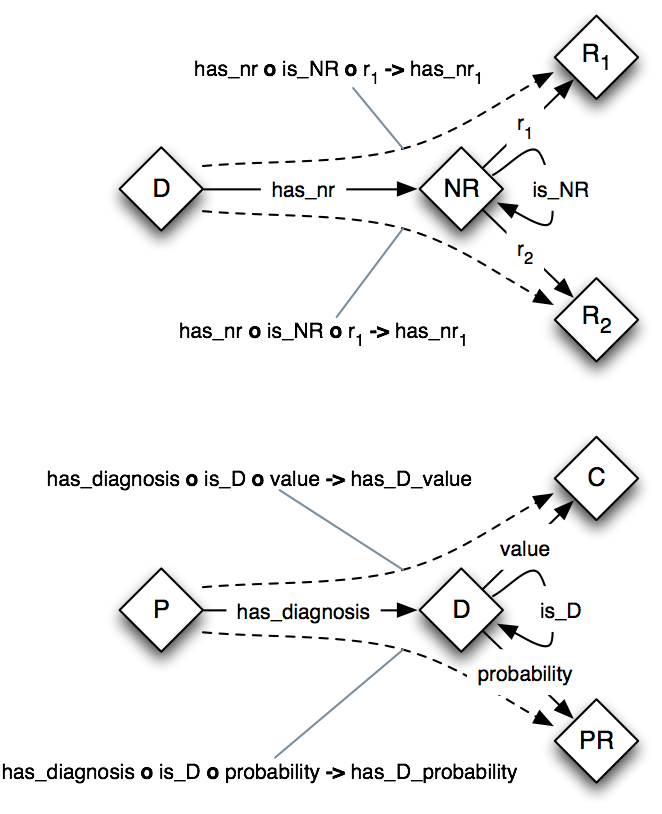

# 

 Graphical representation

__Diagram__ 

# 

 General information

|  |  |
| --- | --- |
|  Name  |  N-Ary Relation Pattern (OWL 2)  |
|  Also known as  |  |
|  Author(s)  |  Rinke Hoekstra  |
|  SubmittedBy  | [RinkeHoekstra](../User/RinkeHoekstra.md "User:RinkeHoekstra")  |

  

# 

 Description

|  |  |
| --- | --- |
|  Motivation  |  OWL does not support N-Ary relations. This means that an n-ary relation can only be represented in its reified form in OWL. This is problematic, as the relational character is then completely lost.  |
|  Aim  |  The aim of this pattern is to allow the inference of property relations between the different relata of the original N-Ary relation based on its reification.  |
|  Solution description  |  The N-Ary relation is reified by creating a class for the relation (NR), and creating properties and classes for the domain (D) and ranges (R1-Rn) of the relation (that is, if the relation is directional). The NR class is specified using a local reflexivity restriction of the form: NR equiv is\_NR some Self. We then specify role chains for each of the binary relations between the domain and ranges. For instance: has\_NR o is\_NR o r1 -> has\_r1  |
|  Elements  |  OWL 2 local reflexivity and property chains.  |
|  Implementation  |  Alter the axioms in the reusable component to suit your needs. The component contains an N-Ary relation with four ranges and a domain. This can easily be extended or reduced.  |
|  Reusable component  | [http://purl.org/net/nary-relation](http://purl.org/net/nary-relation "http://purl.org/net/nary-relation")  |
|  Component type  |  OWL 2 RDF/XML  |

  

# 

 Example

|  |  |
| --- | --- |
|  Problem example  |  See the picture, where the cancer diagnosis relation of the SWBP N-Ary relations patterns is expressed using this design pattern.  |
|  Pattern solution example  |  |
|  Consequences  |  The patient (Christine, P) is related both to the diagnosis value (Cancer) and its probability.  |

  

# 

 Pattern reference

|  |  |
| --- | --- |
|  Origin  |  |
|  Known use  |  |
|  Reference  |  |
|  Related ODP  |  |
|  Used in combination with  |  |
|  Test  |  |

# 

 Additional information

 This pattern is made available under the CC-BY licence (
 [http://creativecommons.org/licenses/by/2.0/](http://creativecommons.org/licenses/by/2.0/ "http://creativecommons.org/licenses/by/2.0/") 
 ). Under this licence the pattern can be freely reused but reusers should include an attribution to the original author (Rinke Hoekstra)
 

 In your academic publications, please refer to this pattern by citing:
Rinke Hoekstra. Ontology Representation – Design Patterns and Ontologies that Make Sense, volume 197 of Frontiers of Artificial Intelligence and Applications. IOS Press, Amsterdam, June 2009.
 

# 

 Scenarios

__Scenarios about N-Ary Relation Pattern (OWL 2)__ 

 No scenario is added to this Content OP.
 

# 

 Reviews

__Reviews about N-Ary Relation Pattern (OWL 2)__ 

|  Review article  | [Posted on](../Property/CreationDate.md "Property:CreationDate")  | [About revision (current is 10281)](../Property/ReviewAboutVersion.md "Property:ReviewAboutVersion")  |
| --- | --- | --- |
| [MarcelFröhlich about N-Ary Relation Pattern (OWL 2)](Community%253AMarcelFröhlich_about_N-Ary_Relation_Pattern_(OWL_2).html "Community:MarcelFröhlich about N-Ary Relation Pattern (OWL 2)")  |  2457865  21 April 2017  |  10281  10,281  |

 This revision (revision ID
 __10281__ 
 ) takes in account the reviews: none
 

 Other info at
 [evaluation tab](http://ontologydesignpatterns.org/wiki/index.php?title=Submissions:N-Ary_Relation_Pattern_%28OWL_2%29&action=evaluation "http://ontologydesignpatterns.org/wiki/index.php?title=Submissions:N-Ary_Relation_Pattern_%28OWL_2%29&action=evaluation") 

  

# 

 Modeling issues

__Modeling issues about N-Ary Relation Pattern (OWL 2)__ 

 There is no Modeling issue related to this proposal.
 

  

# 

 References