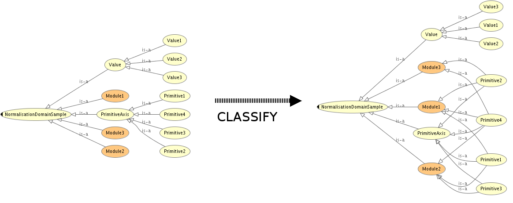

# 

 Graphical representation

__Diagram__ 

# 

 General information

|  |  |
| --- | --- |
|  Name  |  Normalization  |
|  Also known as  |  Modularization, Untangling  |
|  Author(s)  |  AlanRector, MikelEganaAranguren  |
|  SubmittedBy  | [BenedictoRodriguezCastro](../User/BenedictoRodriguezCastro "User:BenedictoRodriguezCastro")  |

  

# 

 Description

|  |  |
| --- | --- |
|  Motivation  |  There are ontologies where a given class can have plenty of superclasses, building a polyhierarchy. If all those subsumption relationships are directly stated by the ontology maintainer, two main problems rise: (i) the ontology becomes very difficult to maintain: whenever a subsumption must be deleted (because a class has changed) or created (because a new class has been created) it has to be done by hand; in a polyhierarchy the process becomes very inefficient and error-prone. (ii) the semantics are implicitly stated, not explicitly: any other ontologist or reasoner only knows that a class is a subclass of its superclasses, without knowing why.  |
|  Aim  |  To untangle a polyhierarchy, coding the subsumption relationships using restrictions rather than class-subclass relationships. The application example for this ODP is adapted from the Cell Type Ontology. In the example, the subsumption relationships that already are in the Cell Type Ontology are inferred by the reasoner instead of hard-coded. The term Neutrophil is used as an example class to show how a class can relate to different modules.  |
|  Solution description  |  |
|  Elements  |  The original classes of the ontology are divided in different axes. The conditions for each subsumption relationship are encoded as restrictions (e.g. [PerformsFunction some Defense]) that will relate the different modules.  |
|  Implementation  |  Identify the modules: group the classes. Create the modules, maintaining only one parent for any given primitive class and making primitive siblings disjoint. Redefine the classes (or define the newly added classes) according to the conditions for belonging to each module. Protege includes a wizard, the restrictions matrix, that helps in the process.  |
|  Reusable component  |  |
|  Component type  |  |

  

# 

 Example

|  |  |
| --- | --- |
|  Problem example  |  |
|  Pattern solution example  | [http://ontologydesignpatterns.org/wiki/Image:Normalisation\_instance.png](../Image/Normalisation_instance.png "http://ontologydesignpatterns.org/wiki/Image:Normalisation_instance.png")  |
|  Consequences  |  The ontology gets untangled and becomes a collection of neat modules. The rest of the semantics are given by restrictions pointing to the modules, and the reasoner maintains the structure, avoding error-prone human maintenance of the polyhierarchy.  |

  

# 

 Pattern reference

|  |  |
| --- | --- |
|  Origin  |  See [(Rector, 2003)](../Community/References/Modularisation_of_domain_ontologies_implemented_in_description_logics_and_related_formalisms_including_owl_3 "Community:References/Modularisation of domain ontologies implemented in description logics and related formalisms including owl 3")  |
|  Known use  |  See [(Rector, 2003)](../Community/References/Modularisation_of_domain_ontologies_implemented_in_description_logics_and_related_formalisms_including_owl_3 "Community:References/Modularisation of domain ontologies implemented in description logics and related formalisms including owl 3")  |
|  Reference  |  |
|  Related ODP  |  |
|  Used in combination with  |  |
|  Test  |  |

# 

 Additional information

# 

 Scenarios

__Scenarios about Normalization__ 

 No scenario is added to this Content OP.
 

# 

 Reviews

__Reviews about Normalization__ 

|  Review article  | [Posted on](../Property/CreationDate "Property:CreationDate")  | [About revision (current is 10129)](../Property/ReviewAboutVersion "Property:ReviewAboutVersion")  |
| --- | --- | --- |
| [CatherineRoussey about Normalization](../Community/CatherineRoussey_about_Normalization "Community:CatherineRoussey about Normalization")  |  2455450  10 September 2010  |  10071  10,071  |
| [BorisVillazón-Terrazas about Normalization](../Reviews/BorisVillazón-Terrazas_about_Normalization "Reviews:BorisVillazón-Terrazas about Normalization")  |  2455456  16 September 2010  |  10071  10,071  |
| [MariCarmenSuarezFigueroa about Normalization](../Reviews/MariCarmenSuarezFigueroa_about_Normalization "Reviews:MariCarmenSuarezFigueroa about Normalization")  |  2455457  17 September 2010  |  10115  10,115  |
| [AndreaNuzzolese about Normalization](../Reviews/AndreaNuzzolese_about_Normalization "Reviews:AndreaNuzzolese about Normalization")  |  2455459  19 September 2010  |  10115  10,115  |

 This revision (revision ID
 __10129__ 
 ) takes in account the reviews: none
 

 Other info at
 [evaluation tab](http://ontologydesignpatterns.org/wiki/index.php?title=Submissions:Normalization&action=evaluation "http://ontologydesignpatterns.org/wiki/index.php?title=Submissions:Normalization&action=evaluation") 

  

# 

 Modeling issues

__Modeling issues about Normalization__ 

|  Modeling issue  | [Competency question](../Property/CompetencyQuestion "Property:CompetencyQuestion")  | [Domains](../Property/Domain "Property:Domain")  |
| --- | --- | --- |
| [Multiple Alternative Classification Criteria](../Community/Multiple_Alternative_Classification_Criteria "Community:Multiple Alternative Classification Criteria")  |  Allow me to retrieve all "elements" (classes/individuals) of a "domain concept" viewed by a combination of "values" (or "terms") from various "classification criteria" (or "facets").  |  |
| [View Inheritance](../Community/View_Inheritance "Community:View Inheritance")  |  For example  in the case of the representation of the "wine" domain concept: <li>        Allow me to select a bottle of wine by color                 region                 flavour and(or) ocassion.       </li> In the case of the representation of the "pizza" domain concept: <li>        Allow me to select a pizza based on the type of base                 the toppings and(or) the name.       </li> |  |

  

# 

 References

* Alan L. Rector. Modularisation of domain ontologies implemented in description logics and related formalisms including owl. In K-CAP '03: Proceedings of the 2nd international conference on Knowledge capture, pages 121{128, New York, NY, USA, 2003. ACM. [ISBN 1-58113-583-1](http://ontologydesignpatterns.org/wiki/Special:BookSources/1581135831)  .  Documentation | [reference page](../Community/References/Modularisation_of_domain_ontologies_implemented_in_description_logics_and_related_formalisms_including_owl_3 "Community:References/Modularisation of domain ontologies implemented in description logics and related formalisms including owl 3")* Normalization Ontology Design Pattern [Documentation](http://www.gong.manchester.ac.uk/odp/html/Normalisation.html "http://www.gong.manchester.ac.uk/odp/html/Normalisation.html")  | [reference page](../Community/References/Normalization_ODP_2 "Community:References/Normalization ODP 2")* Egana-Aranguren, Mikel. Role and Application of Ontology Design Patterns in Bio-ontologies. PhD thesis, School of Computer Science, University of Manchester, 2009. [Documentation](http://mikeleganaaranguren.files.wordpress.com/2010/01/thesis.pdf "http://mikeleganaaranguren.files.wordpress.com/2010/01/thesis.pdf")  | [reference page](../Community/References/Role_and_Application_of_Ontology_Design_Patterns_in_Bio-ontologies "Community:References/Role and Application of Ontology Design Patterns in Bio-ontologies")