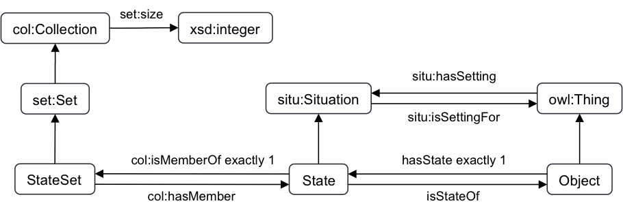

# 

 Graphical representation

__Diagram__ 

# 

 General description

|  |  |
| --- | --- |
|  Name:  |  Object with states  |
|  Submitted by:  | [RaúlGarcía-Castro](../User/RaúlGarcía-Castro "User:RaúlGarcía-Castro")  |
|  Also Known As:  |  |
|  Intent:  |  An object can have different states for which different restrictions apply. The goal of the pattern is to allow modelling the different states of an object and the restrictions on such object for its different states.  |
|  Domains:  | [General](../Community/General "Community:General")  |
|  Competency Questions:  | <li>       Objects must have a unique state      </li><li>       Object states must belong to a single collection of non-duplicate elements (i.e.      </li><li>       to a set)      </li><li>       The possible states are: StateA      </li><li>       StateB and StateC      </li><li>       An object can have three different states      </li><li>       Objects in StateA must have at least one value for property property1      </li><li>       Objects in StateB must have at most one value for property property2      </li><li>       Objects in StateC must have exactly one value for property property3      </li> |
|  Solution description:  |  The pattern contains three classes, one for representing objects, another for representing object states, and a third one for representing sets of states. Besides, it contains object properties for relating objects and states (which are subproperties of those defined in the Situation pattern [ [[1]](http://ontologydesignpatterns.org/cp/owl/situation.owl "http://ontologydesignpatterns.org/cp/owl/situation.owl")  ]) and for relating states and sets of states (reused from the CollectionEntity pattern [ [[2]](http://ontologydesignpatterns.org/cp/owl/collectionentity.owl "http://ontologydesignpatterns.org/cp/owl/collectionentity.owl")  ]) and a datatype property for defining the size of a set of states (reused from the Set pattern [ [[3]](http://ontologydesignpatterns.org/cp/owl/set.owl "http://ontologydesignpatterns.org/cp/owl/set.owl")  ]).  For applying the pattern, first all the possible states of the object must be created as instances of the state class using the Value Partition pattern [[4]](http://www.w3.org/TR/swbp-specified-values/ "http://www.w3.org/TR/swbp-specified-values/")  . Then, different classes must be defined to represent the object in each of the states and state-specific restrictions must be applied to those classes; the object class must be defined as a disjoint union of these classes.  |
|  Reusable OWL Building Block:  | [http://delicias.dia.fi.upm.es/ontologies/ObjectWithStates.owl](http://ontologydesignpatterns.org/wiki/index.php?title=Special:ClickHandler&link=http://delicias.dia.fi.upm.es/ontologies/ObjectWithStates.owl&message=OWL building block&from_page_id=3556&update=)  (731)  |
|  Consequences:  |  The pattern requires modelling states as individuals instead of as literals.  |
|  Scenarios:  |  A sample scenario is the following. A software defect created in an issue tracker must have a creator and be associated to a certain software product. Once it is checked that the defect is reproducible, it must be assigned to some developer and have a certain priority. However, before checking the defect reproducilibty the defect must not have either asignee or priority.  |
|  Known Uses:  | [http://delicias.dia.fi.upm.es/ontologies/alm-istack.owl](http://delicias.dia.fi.upm.es/ontologies/alm-istack.owl "http://delicias.dia.fi.upm.es/ontologies/alm-istack.owl")  |
|  Web References:  |  |
|  Other References:  |  |
|  Examples (OWL files):  | <li><a class="external free" href="http://delicias.dia.fi.upm.es/ontologies/alm-istack.owl" rel="nofollow" title="http://delicias.dia.fi.upm.es/ontologies/alm-istack.owl">        http://delicias.dia.fi.upm.es/ontologies/alm-istack.owl       </a></li> |
|  Extracted From:  |  |
|  Reengineered From:  |  |
|  Has Components:  |  |
|  Specialization Of:  | <li><a href="Submissions%253ASituation.html" title="Submissions:Situation">        Submissions:Situation       </a></li> |
|  Related CPs:  | <li><a href="Submissions%253ACollectionEntity.html" title="Submissions:CollectionEntity">        Submissions:CollectionEntity       </a></li><li><a href="Submissions%253ASet.html" title="Submissions:Set">        Submissions:Set       </a></li> |

  

# 

 Elements

_The
 __Object with states__ 
 Content OP locally defines the following ontology elements:_ 

__hasState__ 
 (owl:ObjectProperty) Defines the state of an object.
 

_[hasState](../Submissions/Object_with_states/hasState "Submissions:Object with states/hasState") 
 page_ 

__isStateOf__ 
 (owl:ObjectProperty) Defines the object that has an state
 

_[isStateOf](../Submissions/Object_with_states/isStateOf "Submissions:Object with states/isStateOf") 
 page_ 

__Object__ 
 (owl:Class) Objects are entities that have different states and that in each state different restrictions on their properties apply.
 

_[Object](../Submissions/Object_with_states/Object "Submissions:Object with states/Object") 
 page_ 

__State__ 
 (owl:Class) States are the different states that an object can have. States must belong to a single collection of non-duplicate elements (i.e., to a set).
 

_[State](../Submissions/Object_with_states/State "Submissions:Object with states/State") 
 page_ 

__StateSet__ 
 (owl:Class) State sets are sets of states (i.e., collections of non-duplicate states).
 

_[StateSet](../Submissions/Object_with_states/StateSet "Submissions:Object with states/StateSet") 
 page_ 

  

  

# 

 Additional information

# 

 Scenarios

__Scenarios about Object with states__ 

 No scenario is added to this Content OP.
 

# 

 Reviews

__Reviews about Object with states__ 

|  Review article  | [Posted on](../Property/CreationDate "Property:CreationDate")  | [About revision (current is 11707)](../Property/ReviewAboutVersion "Property:ReviewAboutVersion")  |
| --- | --- | --- |
| [AlessandroAdamou about Object with states](../Reviews/AlessandroAdamou_about_Object_with_states "Reviews:AlessandroAdamou about Object with states")  |  2456512  7 August 2013  |  11650  11,650  |
| [BenedictoRodriguezCastro about Object with states 2](../Reviews/BenedictoRodriguezCastro_about_Object_with_states_2 "Reviews:BenedictoRodriguezCastro about Object with states 2")  |  2456513  8 August 2013  |  11667  11,667  |
| [BenedictoRodriguezCastro about Object with states](../Reviews/BenedictoRodriguezCastro_about_Object_with_states "Reviews:BenedictoRodriguezCastro about Object with states")  |  2456513  8 August 2013  |  11667  11,667  |
| [RinkeHoekstra about Object with states](../Reviews/RinkeHoekstra_about_Object_with_states "Reviews:RinkeHoekstra about Object with states")  |  2456517  12 August 2013  |  11667  11,667  |

 This revision (revision ID
 __11707__ 
 ) takes in account the reviews:
 [AlessandroAdamou about Object with states](../Reviews/AlessandroAdamou_about_Object_with_states "Reviews:AlessandroAdamou about Object with states") 
 ,
 [RinkeHoekstra about Object with states](../Reviews/RinkeHoekstra_about_Object_with_states "Reviews:RinkeHoekstra about Object with states") 
 ,
 [BenedictoRodriguezCastro about Object with states](../Reviews/BenedictoRodriguezCastro_about_Object_with_states "Reviews:BenedictoRodriguezCastro about Object with states") 
 ,
 [BenedictoRodriguezCastro about Object with states 2](../Reviews/BenedictoRodriguezCastro_about_Object_with_states_2 "Reviews:BenedictoRodriguezCastro about Object with states 2") 

 Other info at
 [evaluation tab](http://ontologydesignpatterns.org/wiki/index.php?title=Submissions:Object_with_states&action=evaluation "http://ontologydesignpatterns.org/wiki/index.php?title=Submissions:Object_with_states&action=evaluation") 

  

# 

 Modeling issues

__Modeling issues about Object with states__ 

 There is no Modeling issue related to this proposal.
 

  

# 

 References

  

|  |  Submission to event [WOP:2013](../WOP/2013 "WOP:2013")  |
| --- | --- |