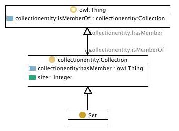

#  Graphical representation

__Diagram__

#  General description

|  |  |
| --- | --- |
|  Name: |  Set |
|  Submitted by: | [EvaBlomqvist](../User/EvaBlomqvist.md "User:EvaBlomqvist") |
|  Also Known As: |  |
|  Intent: |  To model sets of things (elements). A Set is a collection that cannot contain duplicate elements. |
|  Domains: |  |
|  Competency Questions: | <li> What is the cardinality (size) of this set?</li><li> What are the elements in this set?</li> |
|  Solution description: |  A Set is a collection that cannot contain duplicate elements. A Set is expressed by linking to it directly all the members (elements), multiple identical values of members (elements) will be eliminated because by default they are treated as a set. |
|  Reusable OWL Building Block: | [http://www.ontologydesignpatterns.org/cp/owl/set.owl](http://ontologydesignpatterns.org/wiki/index.php?title=Special:ClickHandler&link=http://www.ontologydesignpatterns.org/cp/owl/set.owl&message=OWL building block&from_page_id=3054&update=) (814) |
|  Consequences: |  |
|  Scenarios: |  |
|  Known Uses: |  |
|  Web References: |  |
|  Other References: |  |
|  Examples (OWL files): |  |
|  Extracted From: | <li><a class="external free" href="http://swan.mindinformatics.org/ontologies/1.2/collections.owl" rel="nofollow" title="http://swan.mindinformatics.org/ontologies/1.2/collections.owl">http://swan.mindinformatics.org/ontologies/1.2/collections.owl</a></li> |
|  Reengineered From: | <li><a class="external free" href="http://swan.mindinformatics.org/ontologies/1.2/collections.owl" rel="nofollow" title="http://swan.mindinformatics.org/ontologies/1.2/collections.owl">http://swan.mindinformatics.org/ontologies/1.2/collections.owl</a></li> |
|  Has Components: | <li><a href="../CollectionEntity/CollectionEntity.md" title="Submissions:CollectionEntity">Submissions:CollectionEntity</a></li> |
|  Specialization Of: |  |
|  Related CPs: | <li><a href="../List/List.md" title="Submissions:List">Submissions:List</a></li><li><a href="../Bag/Bag.md" title="Submissions:Bag">Submissions:Bag</a></li> |

  

#  Elements

_The __Set__ Content OP locally defines the following ontology elements:_

 __Set__ (owl:Class) Set - A collection that cannot contain duplicate elements. 
  _[Set](./Set.md "Submissions:Set/Set") page_
 __size__ (owl:DatatypeProperty) size - The number of items belonging to a collection 
  _[size](./Bag/size.md "Submissions:Set/size") page_
#  Additional information

A Set is a collection that cannot contain duplicate elements. A Set is expressed by linking to it directly all the members (elements), multiple identical values of members (elements) will be eliminated because by default they are treated as a set.

The collections ontology (part of the SWAN ontologies) that this pattern is based on was created by Paolo Ciccarese - Massachusetts General Hospital/Harvard Medical School, and Marco Ocana - Balboa Systems Inc. The original ontologies, and related information, are available under a [Creative Commons License](http://creativecommons.org/licenses/by/1.0/ "http://creativecommons.org/licenses/by/1.0/").

#  Scenarios

__Scenarios about Set__
No scenario is added to this Content OP.

#  Reviews

__Reviews about Set__
There is no review about this proposal.
This revision (revision ID __10366__) takes in account the reviews: none

Other info at [evaluation tab](http://ontologydesignpatterns.org/wiki/index.php?title=Submissions:Set&action=evaluation "http://ontologydesignpatterns.org/wiki/index.php?title=Submissions:Set&action=evaluation")

  

#  Modeling issues

__Modeling issues about Set__
There is no Modeling issue related to this proposal.

  

#  References