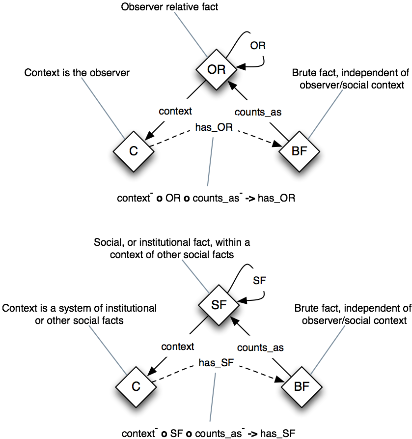

# 

 Graphical representation

__Diagram__ 

# 

 General description

|  |  |
| --- | --- |
|  Name:  |  Social Reality (OWL 2)  |
|  Submitted by:  | [Rinke Hoekstra](http://ontologydesignpatterns.org/wiki/index.php?title=User:Rinke_Hoekstra&action=edit&redlink=1 "User:Rinke Hoekstra (not yet written)")  |
|  Also Known As:  |  Observer Relative and Institutional Facts  |
|  Intent:  |  Capture Searle's theory on observer relative and institutional facts, used in creating social reality. See also the OWL 2 Agent-Role pattern.  |
|  Domains:  |  |
|  Competency Questions:  |  |
|  Solution description:  |  Using the approach taken in [Submissions:N-Ary\_Relation\_Pattern\_(OWL\_2)](Submissions%253AN-Ary_Relation_Pattern_(OWL_2).html "Submissions:N-Ary Relation Pattern (OWL 2)")  we place an observer relative fact (OR) in a context (the observer, C) and the brute fact (BF). For the theory This is a reified relation, and we then specify a role chain that allows us to directly relate the observer (context C) to the brute fact using a relation that reflects the fact that the brute fact counts-as some observer relative fact. See Searle, 1995 (construction of social reality) and/or:  Rinke Hoekstra. Ontology Representation – Design Patterns and Ontologies that Make Sense, volume 197 of Frontiers of Artificial Intelligence and Applications. IOS Press, Amsterdam, June 2009.  Rinke Hoekstra. Representing social reality in owl 2. In Evren Sirin and Kendall Clark, editors, Proceedings of OWLED 2010, June 2010.  for the details of this theory.  |
|  Reusable OWL Building Block:  | [http://purl.org/net/social-reality](http://ontologydesignpatterns.org/wiki/index.php?title=Special:ClickHandler&link=http://purl.org/net/social-reality&message=OWL building block&from_page_id=3017&update=)  (746)  |
|  Consequences:  |  |
|  Scenarios:  |  |
|  Known Uses:  | [http://purl.org/net/lkif-core](http://purl.org/net/lkif-core "http://purl.org/net/lkif-core")  |
|  Web References:  |  |
|  Other References:  |  |
|  Examples (OWL files):  |  |
|  Extracted From:  |  |
|  Reengineered From:  |  |
|  Has Components:  |  |
|  Specialization Of:  |  |
|  Related CPs:  |  |

  

# 

 Elements

_The
 __Social Reality (OWL 2)__ 
 Content OP locally defines the following ontology elements:_ 

# 

 Additional information

 This pattern is made available under the CC-BY licence (
 [http://creativecommons.org/licenses/by/2.0/](http://creativecommons.org/licenses/by/2.0/ "http://creativecommons.org/licenses/by/2.0/") 
 ). Under this licence the pattern can be freely reused but reusers should include an attribution to the original author (Rinke Hoekstra)
 

 In your academic publications, please refer to this pattern by citing:
 

 Rinke Hoekstra. Representing social reality in OWL 2. In Evren Sirin and Kendall Clark, editors, Proceedings of OWLED 2010, June 2010.
 

 and/or
 

 Rinke Hoekstra. Ontology Representation – Design Patterns and Ontologies that Make Sense, volume 197 of Frontiers of Artificial Intelligence and Applications. IOS Press, Amsterdam, June 2009.
 

# 

 Scenarios

__Scenarios about Social Reality (OWL 2)__ 

 No scenario is added to this Content OP.
 

# 

 Reviews

__Reviews about Social Reality (OWL 2)__ 

 There is no review about this proposal.
This revision (revision ID
 __10267__ 
 ) takes in account the reviews: none
 

 Other info at
 [evaluation tab](http://ontologydesignpatterns.org/wiki/index.php?title=Submissions:Social_Reality_%28OWL_2%29&action=evaluation "http://ontologydesignpatterns.org/wiki/index.php?title=Submissions:Social_Reality_%28OWL_2%29&action=evaluation") 

  

# 

 Modeling issues

__Modeling issues about Social Reality (OWL 2)__ 

 There is no Modeling issue related to this proposal.
 

  

# 

 References