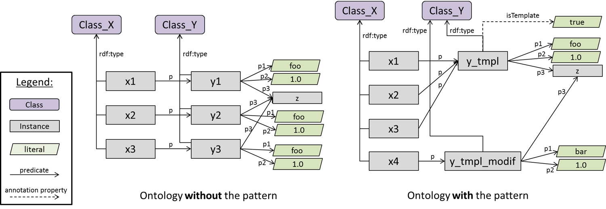

# 

 Graphical representation

__Diagram__ 

# 

 General description

|  |  |
| --- | --- |
|  Name:  |  Template Instance  |
|  Submitted by:  | [CsongorNyulas](../User/CsongorNyulas.md "User:CsongorNyulas")  |
|  Also Known As:  |  |
|  Intent:  |  The Template Instance pattern proposes a way of reducing the number of reified instances and the related property assertion axioms in an ontology, especially for the cases in which the reified relations are identical for multiple entities.  |
|  Domains:  | [General](../Community/General.md "Community:General")  |
|  Competency Questions:  |  |
|  Solution description:  |  The pattern proposes to use the same “template” instance as the value of a reified property for multiple subjects (rather than having multiple copies of the same reified instance). The diagram presents an example of the usage of the pattern, for an easier understanding. The individuals `x1`  , `x2`  and `x3`  have a reified property `p`  that have as values the reified individuals, `y1`  , `y2`  and `y3`  , respectively. In OWL, we would have object property assertions: `(x1 p y1)`  , `(x2 p y2)`  , `(x3 p y3)`  . The properties for the reified individuals, `y1`  , `y2`  and `y3`  are all identical: `(y_ p1 foo)`  , `(y_ p2 1.0)`  and `(y_ p3 z)`  .  The pattern proposes to create a template instance, `y_tmpl`  having the common values as its property values: `(y_tmpl p1 foo), (y_tmpl p2 1.0), (y_tmpl p3 z)`  The template instance would be used as the value for the reified property for `x1`  , `x2`  and `x3`  : `(x1 p y_tmpl), (x2 p y_tmpl), (x3 p y_tmpl)`  In addition, we will also add one annotation property, `isTemplate:true`  , on `y_tmpl`  to mark that it as a template instance.The intention is that the template instance is immutable, i.e., the property values of the template instance cannot be changed.  In the case that a user would like to change a property value of the reified relation, a clone of the template instance would be created and the change would occur on the clone. An ontology editor would use the  isTemplate  annotation property to check that a certain instance cannot be modified, and it should rather create a clone.  The right side of the diagram gives an example of this situation. Say that at a given time t 0  , there was an additional x4 individual that had the template instance as the value for p.  At t 0  : `(x4 p y_tmpl)  (y_tmpl p1 foo), (y_tmpl p2 1.0), (y_tmpl p3 z)`  Later, at time t 1  , the user decides to change the value `p1`  on x4 from “foo” to “bar”. The ontology editor (or the user, if there is no support in the tool), will see the  isTemplate  annotation property on `y_tmpl`  as set on true, and it will create a clone of it, `y_tmpl_modif`  , by cloning also all the object and data property axioms. Then, it will change the value of `p1`  on `y_tmpl_modif`  . So, the result will be:  At t 1  : `(x4 p y_tmpl_modif)  (y_tmpl_modif p1 bar), (y_tmpl_modif p2 1.0), (y_tmpl_modif p3 z)`  As a result of using the Template Instance pattern, one could reduce the number of data and object property axioms in the ontology. This “deflation” of the ontology is especially significant, if there are many repetitive values in the ontology, with very few changes, and if the number of properties of the reified instances is large.  |
|  Reusable OWL Building Block:  | [http://smi-protege.stanford.edu/collab-protege/templInstPattern/template\_instance\_odp.owl](http://ontologydesignpatterns.org/wiki/index.php?title=Special:ClickHandler&link=http://smi-protege.stanford.edu/collab-protege/templInstPattern/template_instance_odp.owl&message=OWL building block&from_page_id=3339&update=)  (821)  |
|  Consequences:  |  |
|  Scenarios:  |  |
|  Known Uses:  | [http://www.who.int/classifications/icd/revision/en/index.html](http://www.who.int/classifications/icd/revision/en/index.html "http://www.who.int/classifications/icd/revision/en/index.html")  , [https://sites.google.com/site/whoictm/](https://sites.google.com/site/whoictm/ "https://sites.google.com/site/whoictm/")  |
|  Web References:  |  |
|  Other References:  |  |
|  Examples (OWL files):  | <li><a class="external free" href="http://smi-protege.stanford.edu/collab-protege/templInstPattern/template_odp_example.zip" rel="nofollow" title="http://smi-protege.stanford.edu/collab-protege/templInstPattern/template_odp_example.zip">        http://smi-protege.stanford.edu/collab-protege/templInstPattern/template_odp_example.zip       </a></li><li><a class="external free" href="http://smi-protege.stanford.edu/collab-protege/templInstPattern/template_instance_odp_example.zip" rel="nofollow" title="http://smi-protege.stanford.edu/collab-protege/templInstPattern/template_instance_odp_example.zip">        http://smi-protege.stanford.edu/collab-protege/templInstPattern/template_instance_odp_example.zip       </a></li> |
|  Extracted From:  |  |
|  Reengineered From:  |  |
|  Has Components:  |  |
|  Specialization Of:  |  |
|  Related CPs:  | <li><a href="../Literal_Reification/Literal_Reification.md" title="Submissions:Literal Reification">        Submissions:Literal Reification       </a></li> |

  

# 

 Elements

_The
 __Template Instance__ 
 Content OP locally defines the following ontology elements:_ 

# 

 Additional information

# 

 Scenarios

__Scenarios about Template Instance__ 

 No scenario is added to this Content OP.
 

# 

 Reviews

__Reviews about Template Instance__ 

|  Review article  | [Posted on](../Property/CreationDate.md "Property:CreationDate")  | [About revision (current is 11178)](../Property/ReviewAboutVersion.md "Property:ReviewAboutVersion")  |
| --- | --- | --- |
| [BenedictoRodriguezCastro about Template Instance](../Reviews/BenedictoRodriguezCastro_about_Template_Instance.md "Reviews:BenedictoRodriguezCastro about Template Instance")  |  2456168  28 August 2012  |  11158  11,158  |
| [BorisVillazón-Terrazas about Template Instance](../Reviews/BorisVillazón-Terrazas_about_Template_Instance.md "Reviews:BorisVillazón-Terrazas about Template Instance")  |  2456175  4 September 2012  |  11178  11,178  |
| [MariaPoveda about Template Instance](../Reviews/MariaPoveda_about_Template_Instance.md "Reviews:MariaPoveda about Template Instance")  |  2456175  4 September 2012  |  11178  11,178  |

 This revision (revision ID
 __11178__ 
 ) takes in account the reviews: none
 

 Other info at
 [evaluation tab](http://ontologydesignpatterns.org/wiki/index.php?title=Submissions:Template_Instance&action=evaluation "http://ontologydesignpatterns.org/wiki/index.php?title=Submissions:Template_Instance&action=evaluation") 

  

# 

 Modeling issues

__Modeling issues about Template Instance__ 

 There is no Modeling issue related to this proposal.
 

  

# 

 References

  

|  |  Submission to event [WOP:2012](../WOP/2012.md "WOP:2012")  |
| --- | --- |