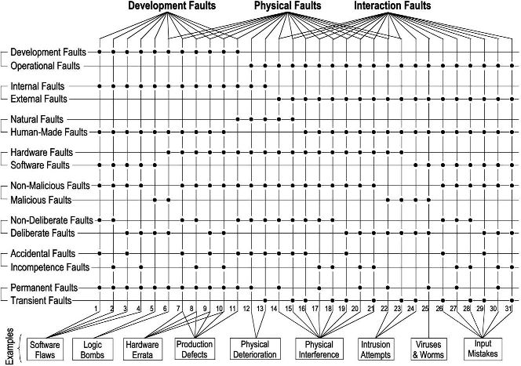
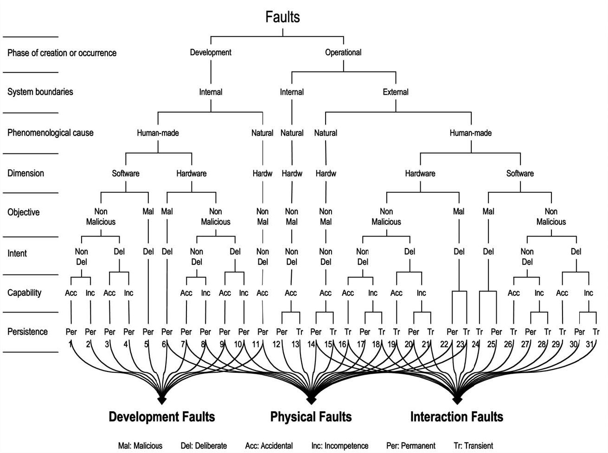

#  Graphical representation

__Diagram__

#  General information

|  |  |
| --- | --- |
|  Name |  View Inheritance |
|  Also known as |  |
|  Author(s) |  Benedicto Rodriguez-Castro, Hugh Glaser |
|  Domain (if applicable) | [General](../Community/General.md "Community:General") |
|  Submitted by | [BenedictoRodriguezCastro](../User/BenedictoRodriguezCastro.md "User:BenedictoRodriguezCastro"), [HughGlaser](http://ontologydesignpatterns.org/wiki/index.php?title=User:HughGlaser&action=edit&redlink=1 "User:HughGlaser (not yet written)") |

  

#  Description

|  |  |
| --- | --- |
|  Problem description |  There are ontology domain concepts that are difficult to represent due to the complexities in their definition and the presence of multiple alternative criteria to classify their abstractions. |
|  Solution description |  Introduce the following types of classes:<li><i>Criterion_i</i>: These classes represent each one of the alternative abstraction criteria of the TargetDomainConcept (<i>Criterion1</i>, <i>Criterion2</i>, <i>Criterion_i</i> in the Figure above). The list of classes may not be exhaustive or pairwise disjoint.</li><li><i>Ci_Class_x</i>: These classes refine each abstraction criteria class (<i>C1_Class1</i>, ..., <i>C2_Class1</i>, ..., <i>Ci_Class_i</i> in the Figure above). The list of classes may not be exhaustive or pairwise disjoint.</li><li><i>CiClass_xCjClass_y</i>, <i>Ci_Class_xClass_y</i>: These classes participate in multiple inheritance relationships combining different refinements from the alternative abstraction criteria classes (<i>C1Class3_C2Class2</i> and <i>C1_Class1Class2</i> in the Figure above).</li> |
|  Implementation workflow |  |
|  Reusable component |  |

  

#  Example

|  |  |
| --- | --- |
|  Problem example |  |
|  Solution example |  Figure above in particular, shows a matrix representation of all types of faults which may affect a system during its life. Implicitly, the figure reveals several alternative criteria for the classification of faults:<li> A first criterion can be derived from the left column of the matrix (listing the basic view points from Figure 2: <i>Development/Operational Faults</i>, <i>Internal/External Faults</i> and so on). This column represents the values of the eight basic viewpoints which lead to the elementary fault classes.</li><li> A second criterion can be abstracted from the bottom row (listing numbers 1 to 31). This row represents the 31 likely combinations of fault classes out of the 256 possible.</li><li> A third criterion is implicit at the top row, representing the three major partially overlapping groupings of faults: <i>Development</i>, <i>Physical</i> and <i>Interaction</i>.</li><li> A fourth criterion can be seen at the bottom row, labeled <i>Examples</i>, containing nine illustrative examples of fault classes.</li> |
|  Consequences | __Inter- and Intra-criterion Multiple Inheritance.__There is an interesting feature regarding the types of multiple inheritance relations that can take place in the context of a View Inheritance pattern. These types of multiple inheritance relationships can be characterized as:<li><b>Inter-criterion</b>, when the parent classes involved in the multiple inheritance relation are subclasses of different abstraction criteria. The class <i>C1Class3_C2Class2</i> in Figure 1 is an example of this type of inheritance because one of its parent classes, <i>C1_Class3</i>, is a refining concept of <i>Criterion1</i> and the other parent class, <i>C2_Class2</i>, is a refining concept of <i>Criterion2</i>.</li><li><b>Intra-criterion</b>, when the parent classes involved in the multiple inheritance relation are subclasses of the same abstraction criterion. The class <i>C1_Class1Class2</i> is an example of this type of inheritance because all of its parents classes, <i>C1_Class1</i> and <i>C1_Class2</i>, are refining concepts of the same criterion, <i>Criterion1</i>.</li><li><b>Intra- and inter-criterion</b>, when there are at least two parents involved in the relation that are subclasses of the same abstraction criterion and there is at least one more different parent that is a subclass of a different abstraction criterion. An example of this type of inheritance is trivial to extrapolate from the composition of the previous two.</li> |

  

#  Pattern reference

|  |  |
| --- | --- |
|  Origin |  Object Oriented:<li> Meyer, B.: Object-Oriented Software Construction (Book/CD-ROM) (2nd Edition). Prentice Hall PTR (March 2000)</li>Ontology:<li> Rector, A.L.: Modularisation of domain ontologies implemented in description logics and related formalisms including owl. In: K-CAP '03: Proceedings of the 2nd international conference on Knowledge capture, New York, NY, USA, ACM (2003) 121--128</li> |
|  Known use |  |
|  Reference |  |
|  Related ODP | [Submissions:Normalization](../Normalization/Normalization.md "Submissions:Normalization"), [Submissions:Partition](../Partition/Partition.md "Submissions:Partition"), [Submissions:ClassAsPropertyValue](http://ontologydesignpatterns.org/wiki/index.php?title=Submissions:ClassAsPropertyValue&action=edit&redlink=1 "Submissions:ClassAsPropertyValue (not yet written)"), [Submission:MultipleInheritance](http://ontologydesignpatterns.org/wiki/index.php?title=Submission:MultipleInheritance&action=edit&redlink=1 "Submission:MultipleInheritance (not yet written)") |

#  Additional information

  

  

  

#  Scenarios

__Scenarios about View Inheritance__
No scenario is added to this Content OP.

#  Reviews

__Reviews about View Inheritance__
There is no review about this proposal.
This revision (revision ID __9979__) takes in account the reviews: none

Other info at [evaluation tab](http://ontologydesignpatterns.org/wiki/index.php?title=Submissions:View_Inheritance&action=evaluation "http://ontologydesignpatterns.org/wiki/index.php?title=Submissions:View_Inheritance&action=evaluation")

  

#  Modeling issues

__Modeling issues about View Inheritance__
There is no Modeling issue related to this proposal.

  

#  References