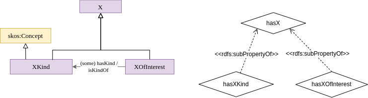

# Pattern Kind of X and X of Interest

The class X (e.g. Feature, Property, Device) represents the class of entities whose type is indeterminate (neither generic nor specific). It can be specialized in a class hierarchy. The class X is equivalent to the disjoint union of XKind and XOfInterest, which represent respectively the class of archetypes of X and specific X. XKind is a subclass of skos:Concept, and these instances are organized into a SKOS model using the skos:broader and skos:narrower properties.
Local restrictions on XKind force more specific and more generic concepts to also be of type XKind.
The hasKind property binds a specific entity to its archetypes. A local restriction on XOfInterest forces any object of the hasKind property to be of archetype XKind. 

The formaliaation is available in [ttl format](patternKindOfXAndXOfInterest.ttl) or [owl format](patternKindOfXAndXOfInterest.owl)
